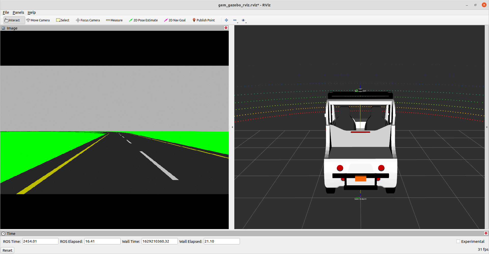
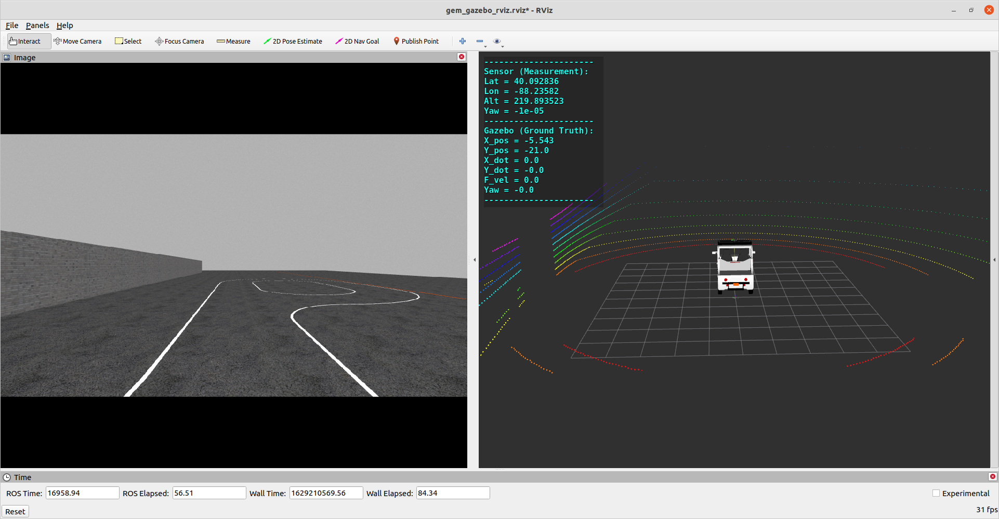
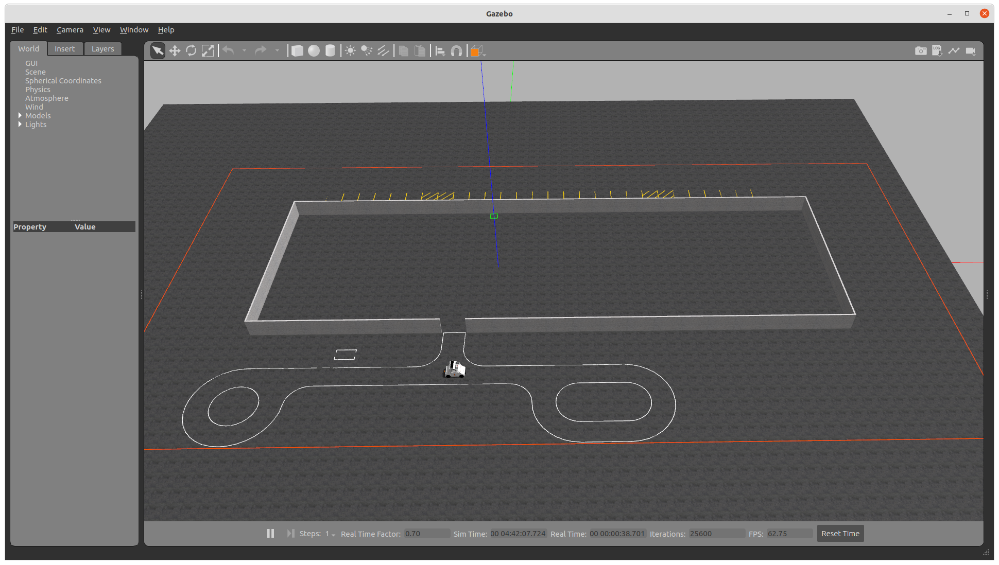

# Polaris GEM e2 Simulator

This repository provides a simulated vehicle model of the [Polaris GEM e2 Electric Cart](https://gem.polaris.com/en-us/e2/) in the [Gazebo](http://gazebosim.org/) simulation environment as well as [ROS](https://www.ros.org/) based sensors and controllers for autonomous driving. The Polaris GEM e2 vehicle model was measured and modeled using SolidWorks by Hang Cui and Jiaming Zhang. Hang Cui further constructed the URDF files of the vehicle model compatible with ROS, RViz, and Gazebo.

The simulator was initially developed for personal research with ROS Melodic and Gazebo 9 in Ubuntu 18.04 in Fall 2019. This simulator then became an essential teaching material for the course, [Principles of Safe Autonomy @ Illinois](https://publish.illinois.edu/safe-autonomy/), and the project subsequently received funding from the [Center for Autonomy](https://autonomy.illinois.edu/) at University of Illinois at Urbana-Champaign. Hang Cui further developed and upgraded the simulator to use ROS Noetic and Gazebo 11 in Summer 2021. This simulator is currently under active development for research and teaching.

This fork additionally provides:

- A **prebuilt Docker image** for one-command bring-up.
- A suite of **rostest + Gazebo safety scenarios** (Battery, Temperature, GPS, Network, Emergency Stop) and an **integration test** (StateManager × Planner).
- A **(WIP)** vision-based lane keeping node (`vision_lka`) that tracks road markings from the front camera and publishes Ackermann commands.

---

## Requirements

Our simulation setup is currently tested with the following system and ROS packages.

**System**: Ubuntu 20.04/22.04 + ROS Noetic (Gazebo 11)

We refer readers to <http://wiki.ros.org/noetic/Installation/Ubuntu> and follow the instructions to install ROS Noetic and Gazebo 11.  
We also recommend **Desktop-Full Install** as suggested in the instructions.

**Required ROS Packages** (for native installs):

- `ackermann_msgs`
- `geometry2`
- `hector_gazebo`
- `hector_models`
- `jsk_rviz_plugins`
- `ros_control`
- `ros_controllers`
- `velodyne_simulator`

After installing ROS Noetic and Gazebo 11 on Ubuntu 20.04, we recommend installing ROS packages using APT as follows:
```bash
$ sudo apt install ros-noetic-ackermann-msgs ros-noetic-geometry2 \
    ros-noetic-hector-gazebo ros-noetic-hector-models ros-noetic-jsk-rviz-plugins \
    ros-noetic-ros-control ros-noetic-ros-controllers ros-noetic-velodyne-simulator
```

---

## Quick Start (Prebuilt Docker Image)

This is the fastest path for reviewers.

1) Pull the image:
```bash
$ docker pull execbat/ros_vehicle_final:latest
```

2) Allow X11 for GUI apps:
```bash
$ xhost +local:root
```

3) Run the container:
```bash
$ sudo docker run -it --rm --net=host \
  -e DISPLAY=$DISPLAY \
  -e QT_X11_NO_MITSHM=1 \
  -v /tmp/.X11-unix:/tmp/.X11-unix:ro \
  --device /dev/dri \
  execbat/ros_vehicle_final:latest \
  bash -lc "source /ros_entrypoint.sh && bash"
```

4) Inside the container, build and launch:
```bash
$ source /opt/ros/noetic/setup.bash
$ catkin_make
$ source devel/setup.bash
$ roslaunch gem_gazebo gem_gazebo_rviz.launch velodyne_points:=true
```

> **NVIDIA GPUs**: install `nvidia-container-toolkit` and append `--gpus all` to the `docker run` command.  
> **Wayland/WSL/macOS**: you need a running X server and proper `DISPLAY` forwarding.

---

## Alternative: Clean ROS Image + Build From Source

Use this if you prefer to build the workspace yourself inside a clean ROS image.

1) Start a clean ROS desktop container:
```bash
$ docker pull ros:noetic-desktop-full
$ xhost +local:root
$ sudo docker run -it --rm --net=host \
  -e DISPLAY=$DISPLAY \
  -e QT_X11_NO_MITSHM=1 \
  -v /tmp/.X11-unix:/tmp/.X11-unix:ro \
  --device /dev/dri \
  ros:noetic-desktop-full \
  bash
```

2) Inside the container, prepare tools and workspace:
```bash
# tools
$ apt-get update && apt-get install -y git python3-rosdep build-essential
$ rosdep init || true
$ rosdep update

# workspace
$ mkdir -p /ws/src && cd /ws/src
$ git clone https://github.com/execbat/POLARIS_GEM_e2.git .
$ cd /ws

# dependencies
$ rosdep install --from-paths src --ignore-src -r -y
```

3) Build and run:
```bash
$ source /opt/ros/noetic/setup.bash
$ catkin_make
$ source devel/setup.bash
$ roslaunch gem_gazebo gem_gazebo_rviz.launch velodyne_points:=true
```

---

## Compile Polaris GEM e2 Simulator (Native Install)

We assume the Catkin workspace is under `~/gem_ws`. Clone this repository to `~/gem_ws/src`:
```bash
$ mkdir -p ~/gem_ws/src
$ cd ~/gem_ws/src
$ git clone https://github.com/execbat/POLARIS_GEM_e2.git
```

Compile the whole workspace with `catkin_make`:
```bash
$ source /opt/ros/noetic/setup.bash
$ cd ~/gem_ws
$ catkin_make
```

For more on Catkin workspaces, see: <http://wiki.ros.org/catkin/Tutorials/create_a_workspace>.

---

## Usage

### Simple Track Environment
```bash
$ source devel/setup.bash
$ roslaunch gem_gazebo gem_gazebo_rviz.launch velodyne_points:=true
```

<a href="url"></a>
<a href="url"></a>

### Geometric based Lateral Controller
```bash
$ source devel/setup.bash
$ roslaunch gem_gazebo gem_gazebo_rviz.launch

$ source devel/setup.bash
$ roslaunch gem_gazebo gem_sensor_info.launch

$ source devel/setup.bash
$ rosrun gem_pure_pursuit_sim pure_pursuit_sim.py
```

<a href="url"></a>

```bash
$ source devel/setup.bash
$ rosrun gem_stanley_sim stanley_sim.py
```

<a href="url"></a>
<a href="url"></a>

### Highbay Environment
```bash
$ source devel/setup.bash
$ roslaunch gem_gazebo gem_gazebo_rviz.launch world_name:="highbay_track.world" x:=-5.5 y:=-21 velodyne_points:="true"

$ source devel/setup.bash
$ roslaunch gem_gazebo gem_sensor_info.launch
```

<a href="url"></a>
<a href="url"></a>

---

### Scenarios & Expected Outcomes

- **Battery Failure**  
  *Profile*: 100% → 51% over 30 s, then drops to 49%.  
  *Expectation*: **ERROR** at **≤ 50%**.

- **Temperature Spike**  
  *Profile*: 30 °C → 55 °C over 30 s, then 60 °C.  
  *Expectation*: **ERROR** at **≥ 55 °C**.

- **GPS Fluctuation**  
  *Profile*: initially high accuracy, then accuracy degrades to **≥ 200 mm** for 20 s.  
  *Expectation*: **ERROR** if **200 mm for ≥ 15 s**.

- **Network Signal Fluctuation**  
  *Profile*: `1 (Connected)` → `2 (Low)` for 10 s → back to `1` → then `0 (Not Connected)` for 20 s.  
  *Expectation*: **ERROR** on sustained **Not Connected**; warning on **Low**.

- **Emergency Stop**  
  *Profile*: `/gem/safety/stop == true`.  
  *Expectation*: **Immediate ERROR**; Planner must be inhibited.

- **Integration: StateManager × Planner**  
  Verify that **navigation tasks are sent only under safe conditions**. Under any ERROR, Planner must **not** publish movement tasks; when back to OK, Planner resumes.

---

## (WIP) Vision-Based Lane Keeping

A prototype node `vision_lka.py` tracks the **left yellow boundary** using HSV∩LAB color masking, vertical scans, and a quadratic fit for heading/curvature. It publishes smooth Ackermann commands and slows down in tight curves.

**Run the LKA node (inside the container):**
```bash
$ source /opt/ros/noetic/setup.bash
$ source /ws/devel/setup.bash
$ rosrun gem_lane_keeping vision_lka.py _steer_sign:=-1.0 \
  image:=/gem/front_single_camera/image_raw \
  cmd:=/gem/ackermann_cmd
```

**Quick tuning at runtime:**
```bash
# if steering is reversed:
$ rosparam set /vision_lka/steer_sign 1.0

# stronger response to lateral error / heading:
$ rosparam set /vision_lka/kp 0.10
$ rosparam set /vision_lka/k_heading 0.30
```

**Topics:**
- Publishes: `/gem/ackermann_cmd` (`ackermann_msgs/AckermannDrive`)
- Diagnostics: `/vision_lka/lateral_error` (`std_msgs/Float32`), `/vision_lka/debug` (`sensor_msgs/Image`)
- Subscribes: `/gem/front_single_camera/image_raw` (`sensor_msgs/Image`)

> Note: LKA is **experimental** in this submission (baseline working, tuning ongoing).

---

## Modules

- `gem_gazebo`: Gazebo worlds, vehicle model, launch files.
- `gem_supervisor` / `state_manager`: monitors safety signals and drives ERROR states.
- `planner`: publishes navigation tasks when safe (integration-tested with StateManager).
- `gem_lane_keeping`: experimental vision-based LKA.

---

## Known Bugs

- The latest Velodyne LiDAR sensor package for Gazebo on Ubuntu 20.04 (`velodyne_simulator`) may publish ROS messages with an incorrect `frame_id` (prefixed by the node’s namespace). TF/TF2 deprecated `tf_prefix`, which can break RViz visualization. See <http://wiki.ros.org/tf2/Migration>.

---

## Developers

- Hang Cui <hangcui1201@gmail.com>

## Contributors

- Jiaming Zhang <jz73@illinois.edu>
- Fork additions: lane-keeping prototype and system tests packaging.
